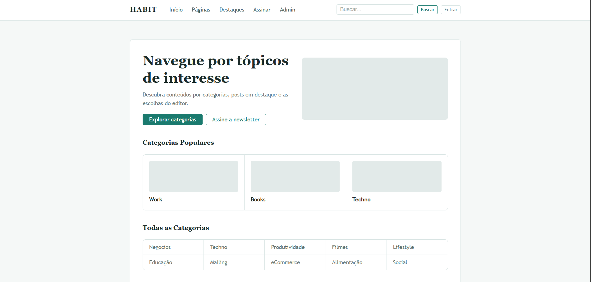

# HABIT - Plataforma de Conteúdo e Blog



## Sobre o Projeto

O HABIT é um projeto acadêmico desenvolvido com o objetivo de recriar interfaces modernas e responsivas utilizando HTML5 e CSS3 a partir de wireframes fornecidos em sala de aula. O sistema simula uma plataforma de blog e gerenciamento de conteúdo, contendo páginas públicas e um painel administrativo completo.

O projeto foi construído aplicando conceitos de semântica HTML, acessibilidade, responsividade mobile-first e organização profissional de arquivos, seguindo boas práticas modernas de desenvolvimento front-end.

---

# 🚧 Em desenvolvimento . . .

---

# 📚 Índice/Sumário

- [Sobre](#sobre-o-projeto)
- [Sumário](#-índicesumário)
- [Requisitos Funcionais](#-requisitos-funcionais)
- [Tecnologias Usadas](#-tecnologias-usadas)
- [Contribuição](#-contribuição)
- [Autores](#-autores)
- [Licença](#-licença)
- [Agradecimentos](#-agradecimentos)

---

# 📋 Requisitos Funcionais

## Área Pública

- [x] Visualizar página inicial
- [x] Navegar por categorias
- [x] Visualizar destaques
- [x] Buscar conteúdos
- [x] Assinar newsletter
- [x] Criar conta
- [x] Fazer login
- [x] Visualizar perfil

## Área Administrativa

- [x] Gerenciar categorias
- [x] Criar postagens
- [x] Gerenciar escolhas do editor
- [x] Gerenciar usuários
- [x] Aprovar postagens
- [x] Moderar comentários
- [x] Visualizar métricas do painel

---

# 💻 Tecnologias Usadas

- HTML5
- CSS3
- Flexbox
- CSS Grid
- Media Queries
- Variáveis CSS
- Git
- GitHub

---

# 📱 Responsividade

O projeto foi desenvolvido utilizando a metodologia Mobile-First, garantindo funcionamento adequado em:

- Celulares pequenos
- Smartphones
- Tablets
- Notebooks
- Monitores grandes

## Breakpoints Utilizados

```css
320px
481px
768px
1024px
1440px
